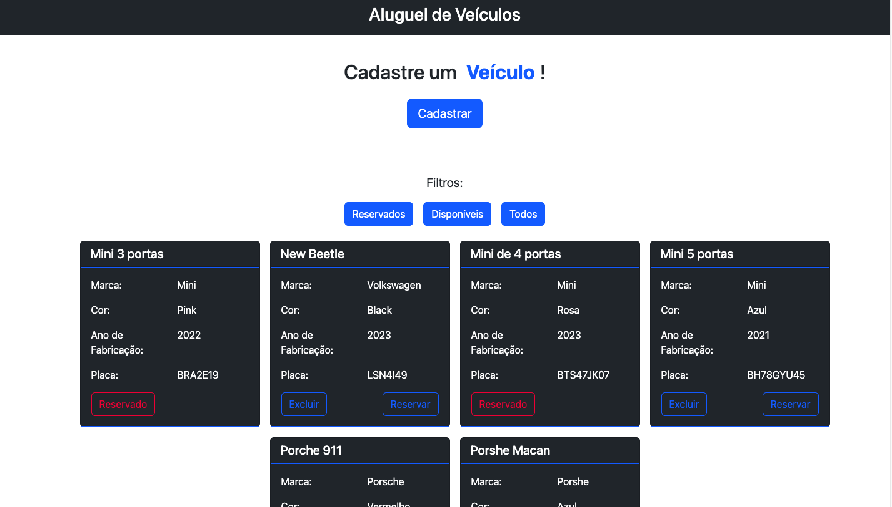
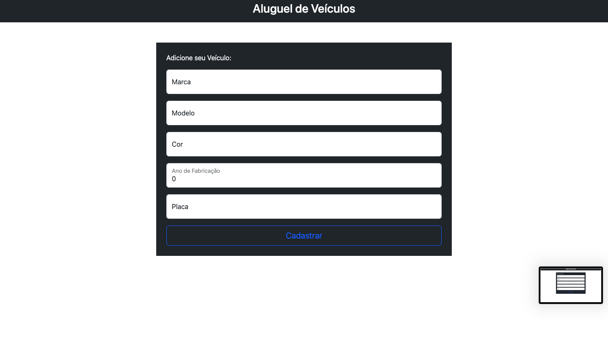
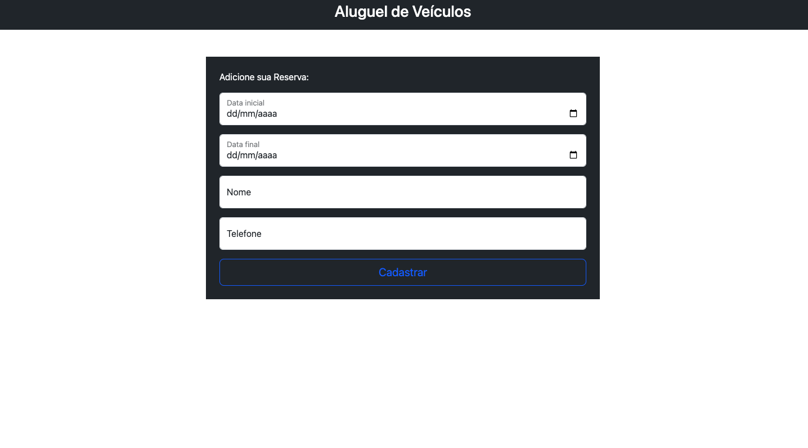
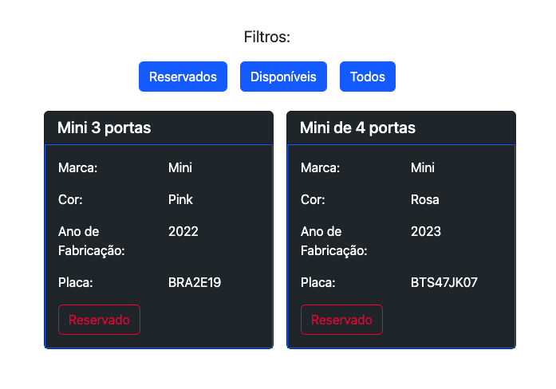

# vehicle-rent
<p>Aplicação de aluguel de veículos:</p>

```diff
@@ Páginas: @@
```
<div align="center" display="flex">
    
    
    
</div>

```diff
@@ Para cancelar uma reserva: @@
```
<p>Aperte no botão Reservado que o modal para cancelar irá aparecer</p>
<div align="center">


</div>


```diff
@@ Para Rodar Localmente: @@
```
- Primeiro clone o repositório para sua máquina:

```
git clone git@github.com:GabiNamu/vehicle-rent.git
```

### Backend:
```diff
! Se não puder rodar o seu backend na porta 8080, mude no frontend no arquivo vehicle.service.ts a variavel apiUrl para a porta que você irá usar
```
- Vá para o diretório do projeto:
```
cd vehicle-rent/backend
```
- Docker:
```
docker-compose up -d
```
- Run:
```
mvn spring-boot:run
```
### Frontend:
```diff
! Se não puder rodar a seu frontend na porta 4200, mude no backend na classe CorsConfiguration para a porta que você irá usar
```
- Vá para o diretório do projeto:
```
cd vehicle-rent/frontend
```
- Run:
```
npm start
```

```diff
@@ Rotas @@
```
Veículo:
  -------------
  
POST `/`:
<details>
  <summary>🔍 Formato/exemplo de requisição e resposta</summary><br />

Exemplo de requisição na rota POST `/`:

```json
{
  "model": "New Beetle",
  "brand": "Volkswagen",
  "color": "black",
  "manufacturing_year": 2020,
  "license_plate": "BRA2E19"
}
```
Exemplo de resposta:
```json
{
  "message": "Veículo criado com sucesso!",
  "data": {
    "id": 1,
    "model": "New Beetle",
    "brand": "Volkswagen",
    "color": "black",
    "manufacturingYear": 2020,
    "licensePlate": "BRA2E19",
    "reserve": null
  }
}
```
</details>

GET `/`:
<details>
  <summary>🔍 Formato/exemplo de resposta</summary><br />

Exemplo de resposta para a rota GET `/`:

```json
[
  {
    "id": 1,
    "model": "New Beetle",
    "brand": "Volkswagen",
    "color": "black",
    "manufacturingYear": 2020,
    "licensePlate": "BRA2E19",
    "reserve": null
  }
]
```
</details>

Delete `/{id}`:
<details>
  <summary>🔍 Formato/exemplo de requisição e resposta</summary><br />

Exemplo de resposta para a rota `/1` (supondo que exista um veículo com `id = 1`:

Exemplo de resposta:
```json
{
  "message": "Veículo removido com sucesso!",
  "data": null
}
```
</details>

Reserva:
  -------------

POST `/{vehicleId}/reserve`:
<details>
  <summary>🔍 Formato/exemplo de requisição e resposta</summary><br />

Exemplo de resposta para a rota Post `/2/reserve` (supondo que exista um veículo com `id = 2`:

```json
{
     "initial_date": "2023-11-25",
     "final_date": "2023-11-27",
     "name": "Marcelo",
     "phone": "73999874976"
  }
```
Exemplo de resposta:
```json
{
  "message": "Reserva criado com sucesso!",
  "data": {
    "id": 1,
    "initialDate": "2023-11-25",
    "finalDate": "2023-11-27",
    "name": "Marcelo",
    "phone": "73999874976"
  }
}
```
</details>

Delete `/{vehicleId}/reserve`:
<details>
  <summary>🔍 Formato/exemplo de requisição e resposta</summary><br />

Exemplo de resposta para a rota Post `/2/reserve` (supondo que exista um veículo com `id = 2`:

Exemplo de resposta:
```json
{
  "message": "Reserva removido com sucesso!",
  "data": null
}
```


